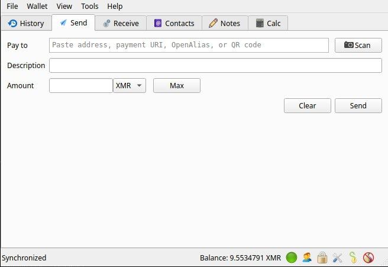

<h1 align="center">ELECTRUM MONERO (XMR)</h1>

[](./CMakeLists.txt)
[](./CMakeLists.txt)
[](#project-scan)
[](./LICENSE)

```text
Privacy-first codebase. Full node, wallet tools, and core protocol logic in one tree.
```

<p align="center">
  
</p>

## Project Scan

This repository contains the Monero core source tree: the daemon, wallet CLI, wallet RPC service, tests, build tooling, and supporting docs.
It is not a thin client and not a UI wrapper. It is the main implementation layer.

| Area | Value |
| --- | --- |
| Runtime | Native binaries |
| Stack | `C++17`, `C11`, `CMake` |
| Main targets | `monerod`, `monero-wallet-cli`, `monero-wallet-rpc` |
| Core code | [`src/`](/home/frank/githubs/GITS/electrum-xmr-/src) |
| Docs and tooling | [`docs/`](/home/frank/githubs/GITS/electrum-xmr-/docs), [`contrib/`](/home/frank/githubs/GITS/electrum-xmr-/contrib), [`utils/`](/home/frank/githubs/GITS/electrum-xmr-/utils) |

## Inside The Tree

`src/daemon/` -> node process and daemon flow  
`src/simplewallet/` -> terminal wallet layer  
`src/wallet/` -> wallet engine and RPC side  
`tests/` -> regression and behavior coverage  
`external/` + `.gitmodules` -> bundled dependency surface

## Build Path

```text
sync deps   -> git submodule update --init --recursive
configure   -> cmake -S . -B build
compile     -> cmake --build build -j
```

## First Launch

```text
node        -> ./build/bin/monerod
wallet      -> ./build/bin/monero-wallet-cli
```

<p align="center">
  
</p>
